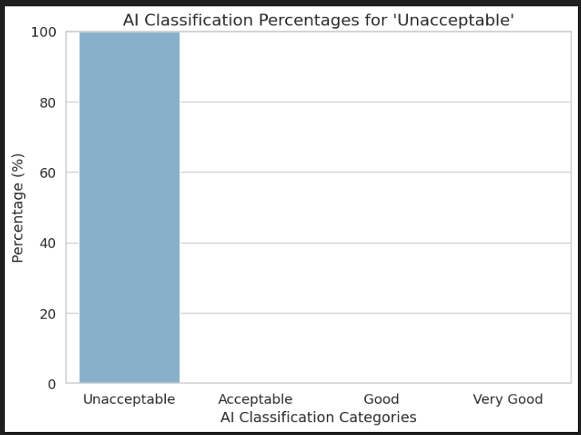
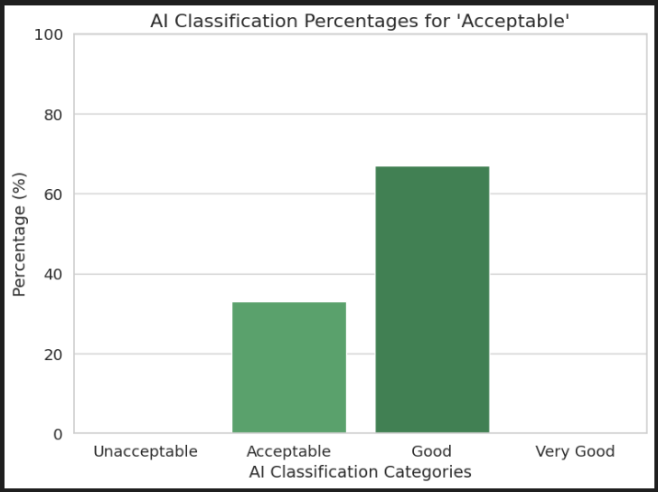

# ai-rationality

This project studies the rationality of AI by analyzing how it classifies car acceptability based on certain conditions.

## Dataset description:

https://www.kaggle.com/datasets/elikplim/car-evaluation-data-set

The dataset contains 1728 rows with 7 columns with descriptions as below:

- buying_price: Buying price; contains 4 unique values (low, med, high, vhigh)
- maintenance_cost: Maintenance cost; contains 4 unique values (low, med, high, vhigh)
- number_of_doors: Number of doors; contains 4 unique values (2, 3, 4, 5more)
- number_of_persons: Capacity in terms of persons to carry; contains 3 unique values (2, 4, more)
- lug_boot: Size of the luggate boot; contains 3 unique values (small, med, big)
- safety: Estimated safety; contains 3 unique values (low, med, high)
- decision: Car acceptability; contains 4 unique values (unacc, acc, good, vgood)

The class distribution is as follows:

- unacc: 1210 instances (70.02%)
- acc: 384 instances (22.22%)
- good: 69 instances (3.99%)
- vgood: 65 instances (3.76%)

## Methodology

Since the "unacc" and "acc" classes account for about 92% of the dataset, these 2 categories are selected for evaluating the performance of our AI agents. The goal is to identify one representative car (using the most median-like row) for each class, abd then ask decisions from 100 agents for each car. The responses provided by these agents will be compared to the actual decisions in the dataset.

### 1. Find median-like rows

After performing data cleaning and feature engineering to transform categorical variables into numerical representations, we calculate the median value for each column within each class. The most representative row is determined by selecting the row with the minimum distance to the median values of the class. Detailed process in `data_processing.ipynb`.

Here are four median-like rows corresponding to each class:

**Class unacc**
- buying_price:       high
- maintenance_cost:   high
- number_of_doors:    3
- number_of_persons:  4
- lug_boot:           med
- safety:             med
- decision:           unacceptable

**Class acc**
- buying_price:       med
- maintenance_cost:   med
- number_of_doors:    4
- number_of_persons:  4
- lug_boot:           med
- safety:             high
- decision:           acceptable

**Class good**
- buying_price:       low
- maintenance_cost:   low
- number_of_doors:    4
- number_of_persons:  4
- lug_boot:           med
- safety:             med
- decision:           good

**Class vgood**
- buying_price:       low
- maintenance_cost:   med
- number_of_doors:    4
- number_of_persons:  6
- lug_boot:           big
- safety:             high
- decision:           very good

### 2. Make API calls

The model used for this task is GPT-4.0 Mini from OpenAI. The prompt combines two messages: the system message specifies the context, while the user message details the car conditions and requests an evaluation from the AI agents. The prompt is structured as below:

System message: "You are an AI agent tasked with evaluating cars based on specific conditions. You will choose one of the following evaluations: unacceptable, acceptable, good, very good. You must provide only one evaluation, without any additional explanation."

User message: "Given the following car conditions:

- Buying price: {buying_price}
- Maintenance cost: {maintenance_cost}
- Number of doors: {number_of_doors}
- Number of persons it can carry: {number_of_persons}
- Size of the luggate boot: {lug_boot}
- Car safety level: {safety}

Choose one of the following evaluations for this car:

- unacceptable
- acceptable
- good
- very good

Your response should be one of the 4 above options, without any other words."

## Result

For the "unacceptable" car, the AI agents consistently chose "unacceptable," giving a 100% correct classification rate. However, for the "acceptable" case, only 33% of the agents correctly classified it as "acceptable," while 67% classified it as "good."

## Interpretation

This experiment highlights some observations that are important for understanding AI rationality for classification.

### 1. Unacceptable class: 100% accuracy

The AI model is highly confident in identifying a car that fits the "unacceptable" criteria based on the provided features. The attributes of this row likely align well with common decision-making patterns that would lead a rational agent to classify it as "unacceptable."

### 2. Acceptable class: 33% accuracy

This is a nuanced result. The AI agents seem to have a preference for classifying this car as "good" rather than "acceptable." There could be certain reasons for this:

- **Feature ambiguity**: The features provided for the "acceptable" class may be close to the boundary between "acceptable" and "good" decisions. The agent might be interpreting the car as slightly better than "acceptable" based on certain attributes, like `safety` being "high" or `maintenance cost` being "med".

- **Agent bias**: The agents might have internal biases that favor cars with certain characteristics (For example, prioritizing safety or price over other factors), which leads them to classify cars as "good" more frequently.

- **Misinterpretation**: The model may reflect the inherent uncertainty in the classification task, where human evaluators might also hesitate between categories like "acceptable" and "good."

### Insights:
- **Confidence vs ambiguity**: The AI model appears to be confident when classifying extreme cases like "unacceptable" (100% correct), but struggles with more ambiguous cases like "acceptable".

- **Rationality**: The AI's rationality can be questioned in "middle cases" like the "acceptable" class. Although its decision is not totally wrong, it seems overconfident in classifying cases as "good" rather than being more cautious in choosing "acceptable." This raises the question of whether the AI’s decision-making process aligns with human reasoning or if it overestimates certain attributes as more important than they might be in the context of the dataset.

- **Possible Improvements**: The AI model could be trained or tuned to improve its classification of borderline cases. This could involve:
   - **Fine-tuning on edge cases**: By providing more examples of cars that are borderline between "acceptable" and "good," the AI may learn to make more nuanced decisions.
   - **Exploring decision thresholds**: Introduce a soft decision threshold where the AI can recognize when it’s not confident and classify cars as "acceptable" when there’s ambiguity.
  
## Further considerations:
1. **Class balancing**: The imbalance in the dataset (with a dominant "unacceptable" class) may be influencing the AI's behavior. AI models might overestimate the dominant class and underrepresent more nuanced classes.
   
2. **Data characteristics**: If the characteristics of the "acceptable" car are closer to the "good" category (such as having a high safety level), the AI may be overfitting these features and giving them more weight than they deserve.

3. **Model behavior**: This experiment indicates that the AI model could benefit from further calibration. In cases of uncertainty, a rational agent might choose the more conservative option (for example, "acceptable") instead of being overconfident and choosing "good" inappropriately. This could be adjusted by introducing additional context that emphasizes the boundaries between adjacent classes.

## Conclusion

In summary, the 100% accuracy for the "unacceptable" class suggests that the model behaves rationally when the decision is evident, but it struggles with uncertain classifications like "acceptable". This could be due to overfitting certain features and a lack of distinction between similar classes.